# Aplicativo G-VIS 💚

O aplicativo G-VIS foi desenvolvido durante o Programa de Residência em TIC, um programa da empresa BRISA que possuia o objetivo de capacitar estudantes para se tornarem desenvolvedores de sistemas. Estes estudantes, foram dividos em grupos, onde cada grupo era responsável por concluir um projeto real de uma empresa real, sendo acompanhados e orientados durante todo o programa.

## A missão do projeto 🎯

Este projeto possui como objetivo a migração de um aplicativo antigo, desenvolvido em Xamarin, para o framework Flutter.

O aplicativo G-VIS é um sistema de gestão para Vigilâncias Sanitarias desenvolvido pela empresa Inovadora, de Joaçaba. Com o auxílio da empresa, o grupo foi capaz de migrar o aplicativo antigo para um framework novo e atual.

## Como rodar o projeto 👨‍💻👩‍💻

Primeiramente [instale Flutter e todos os requisitos necessários](https://docs.flutter.dev/get-started/install), então clone o projeto em sua máquina e utilize os seguintes comandos:

```
flutter pub get
flutter run
```

Para gerar um arquivo APK do projeto e instalar em qualquer dispositivo móvel Android, utilize o seguinte comando:

```
flutter build apk
```

## Principais telas do projeto

<table>
  <tr>
    <td align="center">
      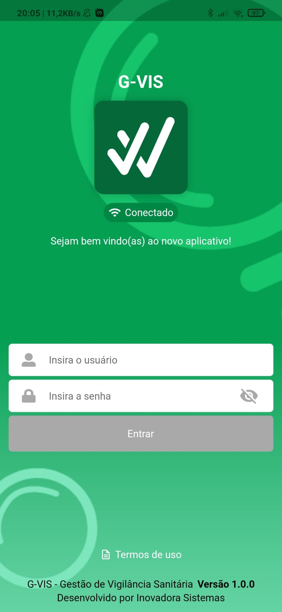"/>
      <br/>
      Tela de login vazia
    </td>
    <td align="center">
      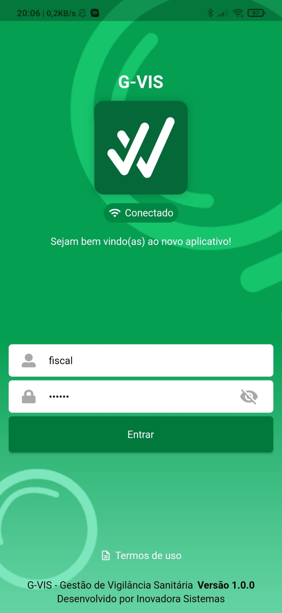"/>
      <br/>
      Tela de login preenchida
    </td>
    <td align="center">
      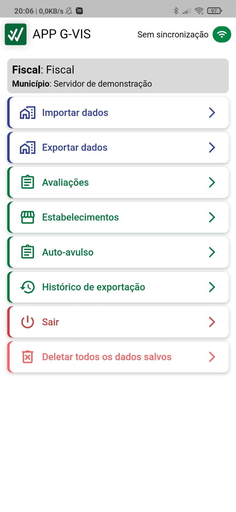"/>
      <br/>
      Tela inicial
    </td>
  </tr>
  <tr>
    <td align="center">
      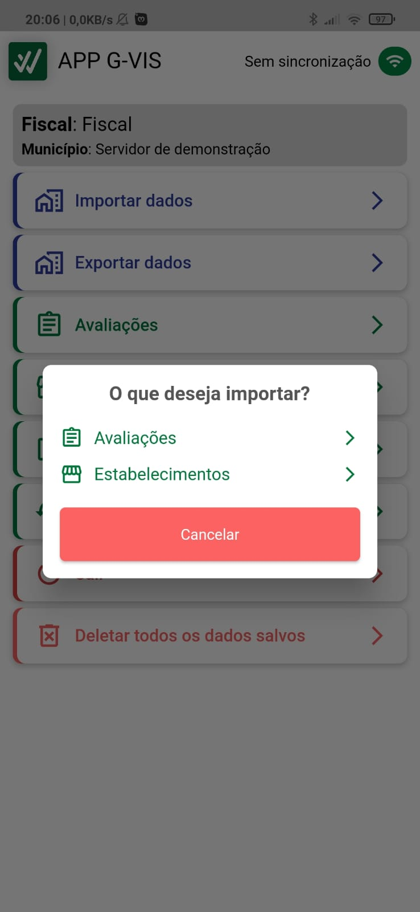"/>
      <br/>
      Pop-up para importar
    </td>
    <td align="center">
      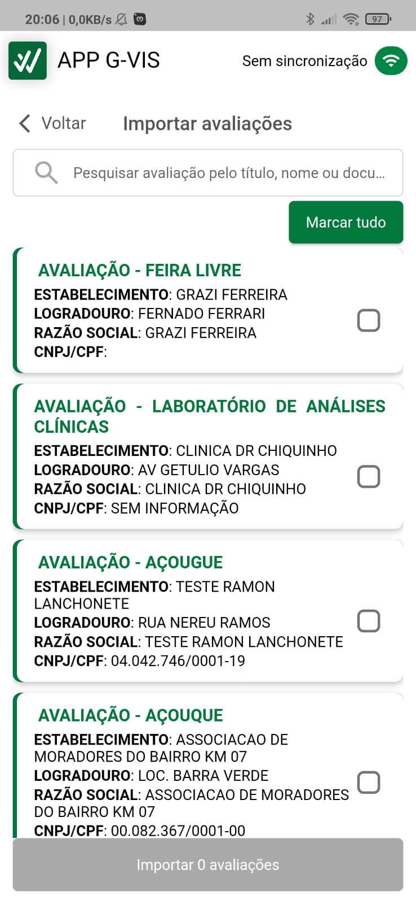"/>
      <br/>
      Tela de importar avaliações
    </td>
    <td align="center">
      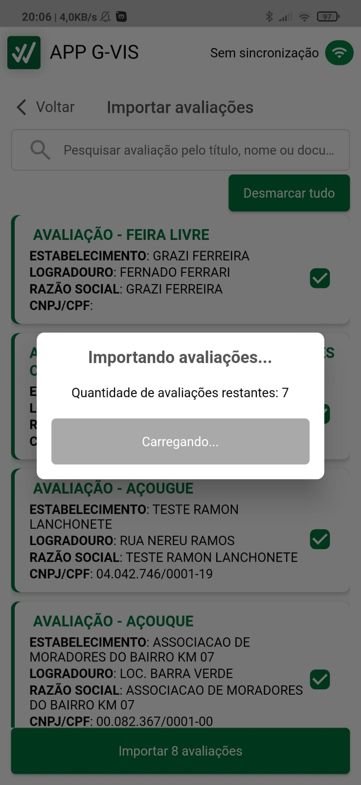"/>
      <br/>
      Pop-up de importações restantes
    </td>
  </tr>
  <tr>
    <td align="center">
      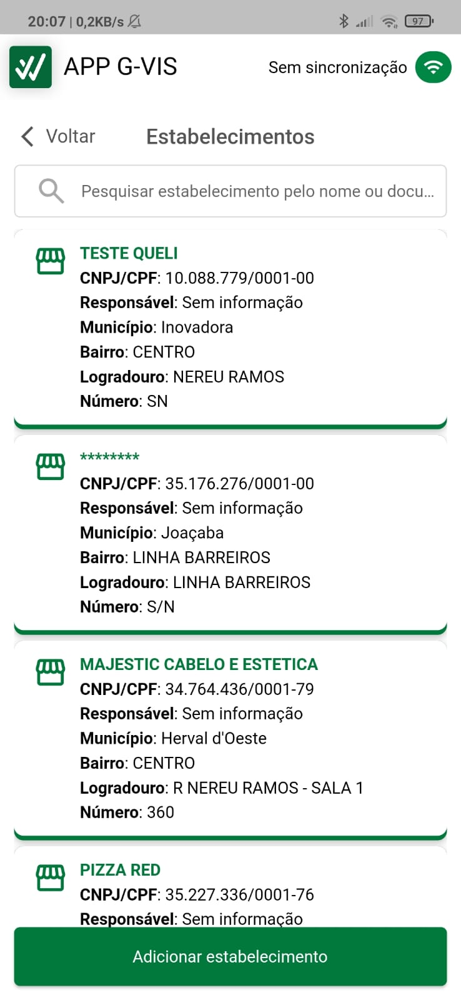"/>
      <br/>
      Tela de listagem de estabelecimentos
    </td>
    <td align="center">
      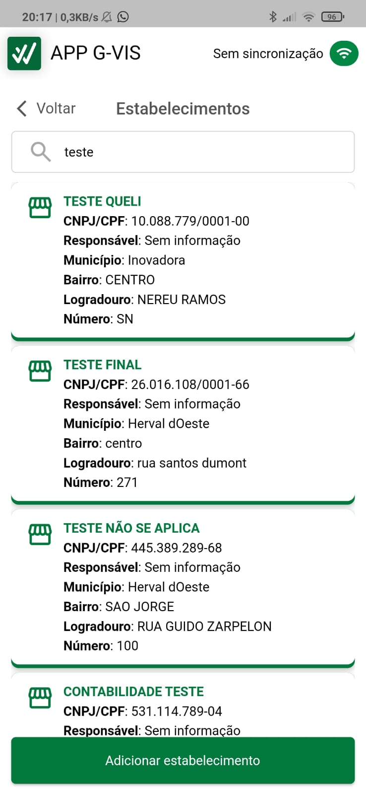"/>
      <br/>
      Filtro de estabelecimentos ativo
    </td>
    <td align="center">
      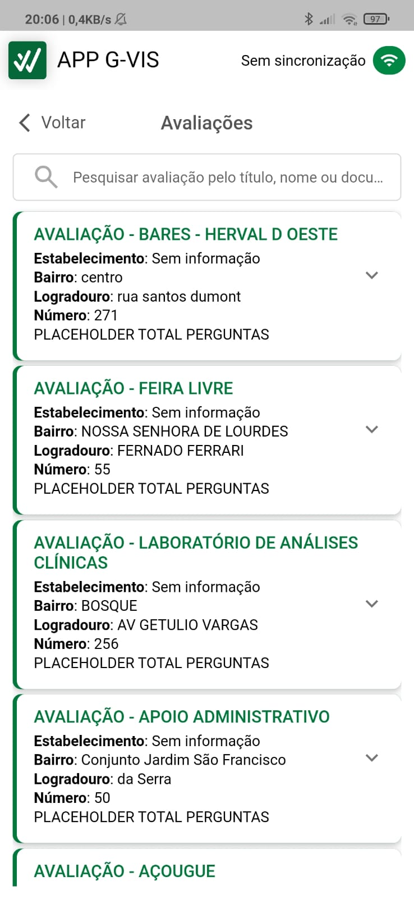"/>
      <br/>
      Tela de listagem de avaliações
    </td>
  </tr>
  <tr>
    <td align="center">
      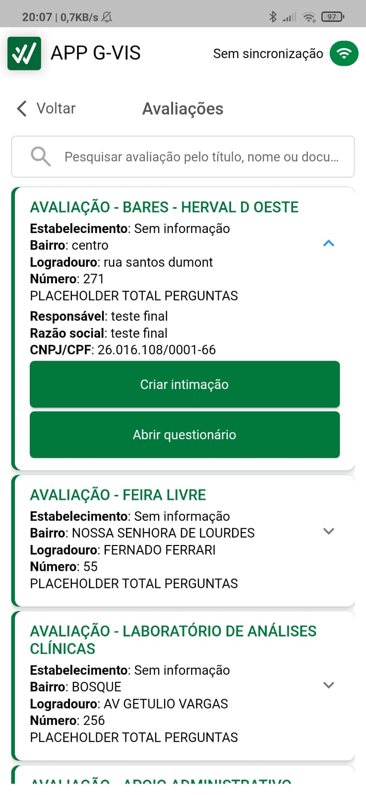"/>
      <br/>
      Avaliação expandida
    </td>
    <td align="center">
      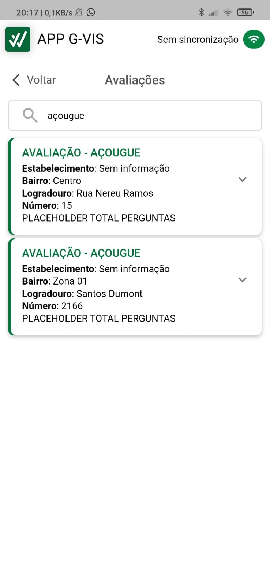"/>
      <br/>
      Filtro de avaliações ativo
    </td>
    <td align="center">
      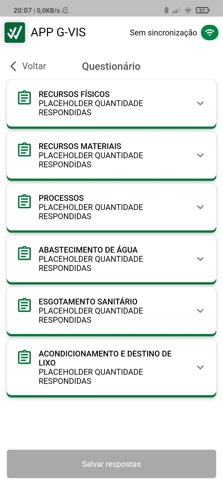"/>
      <br/>
      Tela de questionário
    </td>
  </tr>
</table>

## Autores do projeto 💕✨

<table>
  <tr>
    <td align="center">
      <a href="https://www.linkedin.com/in/lucas-belini">
        
        <br/>
        <sub><b>Lucas Belini</b></sub>
      </a>
      <br/>
      <a href="https://github.com/LukasxzB">
        <sub><b>GitHub</b></sub>
      </a>
      <br/>
    </td>
    <td align="center">
      <a href="https://www.linkedin.com/in/gabriel-gois-943ab3205/">
        
        <br/>
        <sub><b>Gabriel Gois</b></sub>
      </a>
      <br/>
      <a href="https://github.com/G-Gois">
        <sub><b>GitHub</b></sub>
      </a>
      <br/>
    </td>
  </tr>
</table>
